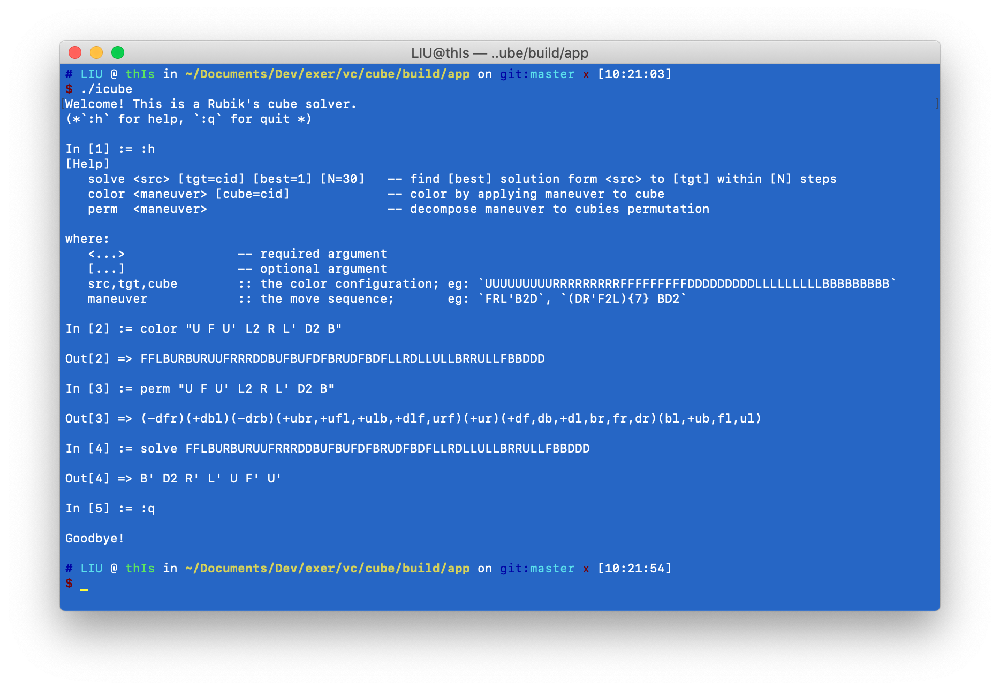

# Cube

## 0 - Introduction

This project is a Rubik's Cube solver built around a C++ re-implementation 
of Kociemba's twophase algorithm, inspired by the original mathematica code from [1].

It includes the following components:
  - libcube: the core C++ library with C-style interface exported;
  - pycube: the Python binding package via [ctypes](https://docs.python.org/3/library/ctypes.html);
  - jscube: the JavaScript binding package via [emscripten](https://emscripten.org/);
  - Cube.framework: the swift framework;
  - icube: the command-line executable.

## 1 - Build, install & package

Prerequisites:
  - Cmake: to build libcube;
  - Emscripten & npm: to build jscube;
  - Python: to build pycube.

1. Build

```sh
# build
cmake -B build -G "Ninja" \
  -DCMAKE_BUILD_TYPE=Release \
  -DBUILD_SWIFT_MODULE=on \
  -DBUILD_PYTHON_BINDING=on \
  -DBUILD_WASM_BINDING=on \
  -DCMAKE_INSTALL_PREFIX="<prefix>" \
  -DCUBE_PACK_DIR="<dir>"

cmake --build build --config Release

# install 
# (default location: 
#   - linux,macOS: "/usr/local"
#   - win: "C:/Program Files/${PROJECT_NAME}")
cmake --build build --target install --config Release

# package (default location: "build/dist")
cmake --build build --target pack --config Release
```

### 2 - Usage

1. icube


2. bindings
  - [pycube](bindings/python/pycube/core.py)
  - [jscube](bindings/wasm/src/api.mts)
  - [Cube.framework](bindings/swift/Cube.swift)

## References

1. [http://kociemba.org/cube.htm](http://kociemba.org/cube.htm)
