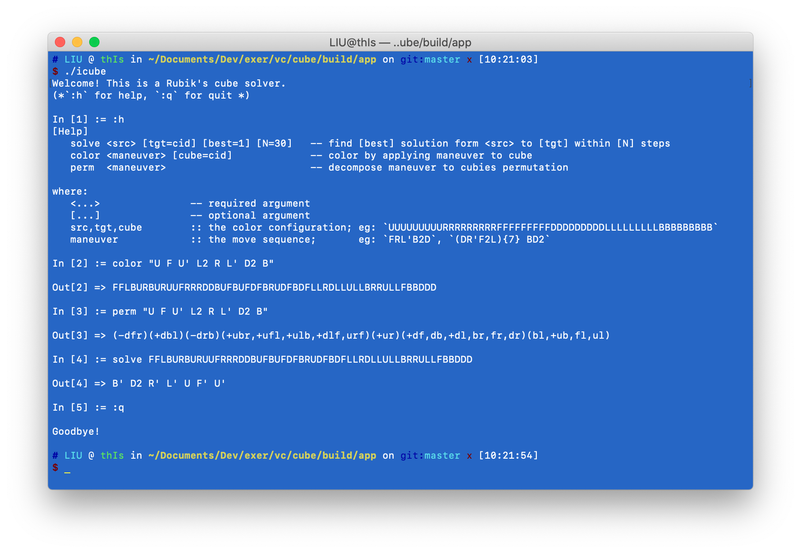

## 0 - Introduction

This project is a Rubik's Cube solver built around a C++ re-implementation 
of Kociemba's twophase algorithm, inspired by the original mathematica code from [1].

It inclues:
  - libcube: the core C++ library with C-style interface exported;
  - pycube: the Python binding package via [ctypes](https://docs.python.org/3/library/ctypes.html);
  - jscube: the JavaScript binding package via [emscripten](https://emscripten.org/);
  - icube: the command-line executable.

## 1 - Build 

Prerequisites:
  - Cmake: to build libcube;
  - Emscripten & npm: to build jscube;
  - Python: to build pycube.

Build & package
1. sdk: run `scripts/build_libcube.sh`;
2. jscube: run `scripts/pack_jscube.sh`;
3. pycube: run `scripts/pack_pycube.sh`;

(An example to package sdk, jscube and pycube): 

```Bash
#!/usr/bin/env bash
export BUILD_SDIST=true             # false: whl only; true: whl + sdist
rm -rf dist/                        # clean old files
sh scripts/build_libcube.sh package # subcommand: package
sh scripts/pack_pycube.sh
sh scripts/pack_jscube.sh
```

### 2 - Usage

1. icube


2. pycube: see [test](python/test/test_cube.py).

3. jscube: see [node-test](wasm/test/test_jscube-node.1.mjs), [web-test](wasm/test/test_jscube-web.2.html).

## References

1. [http://kociemba.org/cube.htm](http://kociemba.org/cube.htm)